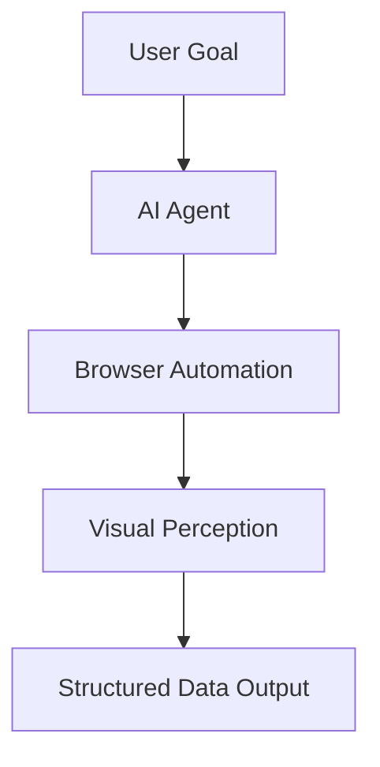

For decades, web scraping has relied on static scripts. Developers manually write code to find specific HTML elements and extract their values. But the rise of AI agents is fundamentally changing the game.

## The Brittle Nature of Traditional Scrapers

Traditional scrapers are fragile. A minor website update—like changing a CSS class name—can break your entire extraction logic.

*   **CSS Selector Changes**: Scraper fails.
*   **Layout Redesigns**: Total rewrite required.
*   **Infinite Scrolling**: Complex logic needed.

Maintaining large scraping systems requires constant developer intervention.

## Enter AI Web Agents

AI agents don't look at HTML code the same way scripts do. They use vision and context to interact with websites dynamically.

> [!INSIGHT]
> Instead of looking for `DIV.price-card__value`, an AI agent asks: **"Where is the price on this page?"** It understands the visual layout and context, just like a human browsing the web.

### Why AI Agents Are Powerful
1.  **Adaptive Extraction**: They automatically adjust to page changes.
2.  **Autonomous Navigation**: They can figure out how to navigate complex menus or find specific data points without pre-programmed paths.
3.  **Human-like Interaction**: They interact with elements naturally, reducing the risk of bot detection.

## The Role of Browser Automation

Modern AI agents rely on frameworks like **Puppeteer** or **Playwright**. These tools allow AI systems to control a "real" browser programmatically. Combined with Large Language Models (LLMs), these agents can perform intelligent browsing tasks:

*   "Find the cheapest flight from NYC to London next Tuesday."
*   "Extract all legal disclaimer text from these 50 websites."
*   "Log in, navigate to billing, and download the last 3 invoices."

## Future: AI-Driven Data Flows

In the near future, the boundary between "Scraping" and "Browsing" will disappear. Developers will simply define a goal, and the AI agent will handle the rest—from proxy rotation to complex data cleaning.

## What This Means for Crawl Pilot

Visual scraping tools like **Crawl Pilot** represent a major step toward this future. By simplifying the interaction layer, we enable a hybrid approach: **AI intelligence + user-friendly visual tools.** This allows anyone to build powerful automation without writing a single line of fragile code.

---

**Step into the future of data extraction.** [Experience Crawl Pilot's visual scraper](https://crawlpilot.tech).
