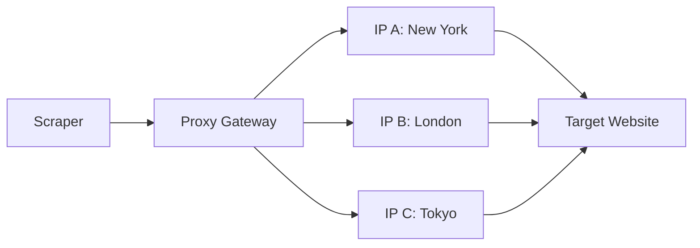

Every web scraping system eventually encounters the same problem: **IP blocking.**

When a scraper sends too many requests from a single IP address, websites quickly detect and block it. This is why proxy networks have become one of the most important pieces of the scraping ecosystem.

Behind the scenes, an entire industry exists to provide millions of rotating IP addresses for data extraction.

## Why Scrapers Need Proxies

Websites track request origin using IP addresses. If too many requests come from the same source, the server may trigger rate limits, CAPTCHAs, or total IP bans. Proxy networks solve this by spreading traffic across thousands of different locations.

## Types of Scraping Proxies

The proxy industry typically offers three core categories of IP addresses:

### 1. Datacenter Proxies
These IPs come from secondary cloud providers.
*   **Pros**: Fast, inexpensive, high bandwidth.
*   **Cons**: Easily detected. Most anti-bot systems flag these provider ranges by default.

### 2. Residential Proxies
Originating from real consumer devices (home Wi-Fi).
*   **Pros**: Extremely difficult to detect; appear as real human users.
*   **Cons**: More expensive; slower than datacenters.

### 3. Mobile Proxies
Utilizing cellular network IPs (4G/5G).
*   **Pros**: Highest trust scores; shared IP pools make blocking them nearly impossible.
*   **Cons**: Most expensive; limited availability.

> [!TIP]
> **Pro Tip**: Use Residential proxies for target sites with high security (like Amazon or LinkedIn), and Datacenter proxies for simpler, high-volume tasks to save on costs.

## How Proxy Rotation Works

Instead of sending requests from a single server, traffic is routed through a "Gatekeeper" that assigns a new IP for every request or session.

## The Economics of Proxy Infrastructure

Proxy networks typically charge based on **bandwidth (GB)** or **IP usage**. Large-scale scraping operations can spend thousands of dollars per month on infrastructure alone to ensure their success rates stay high.

## The Future of Scraping Infrastructure

As websites improve bot detection, proxy networks are evolving to include AI-driven traffic simulation and automatic proxy selection to ensure the highest possible success rate for data extraction.

---

**Build your own proxy-powered scraper in minutes.** [Try Crawl Pilot now](https://crawlpilot.tech).
